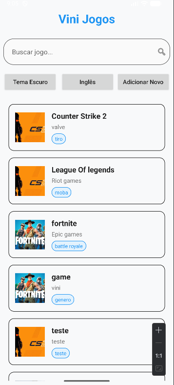
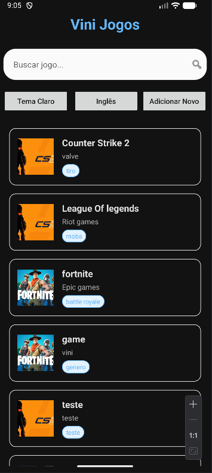
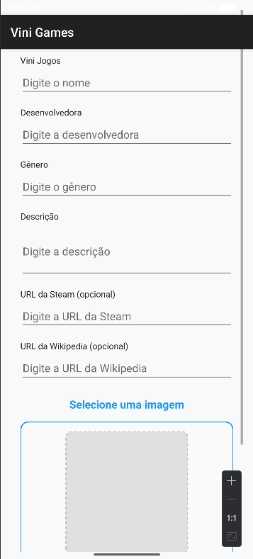
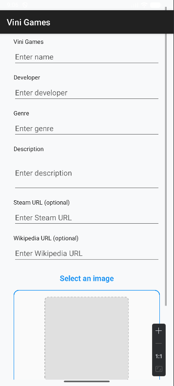

# 📱ViniGames - Aplicativo de Catálogo de Jogos
> Projeto Android desenvolvido como parte do curso de Desenvolvimento Mobile no IFSP.

---

## Descrição
O ViniGames é um catálogo de jogos onde dá pra ver uma lista com vários títulos e clicar em cada um pra abrir os detalhes, adicionar novos jogos e filtrar pelos jogos.
### Funcionalidades
- Listagem de jogos com imagem
- Tela de detalhes com Intents explícitas
- botões para ir direto para a steam ou wikipedia
- filtro para os jogos
- adicionar novos jogos
## Capturas de Tela

  
  

  

  
  

 

---
## Demonstração
- [Assista no Youtube]([https://youtube.com/shorts/9E3qiy-PxCE?feature=share](https://youtube.com/shorts/bpw_od8d9QY?feature=share)
- [Vídeo demonstrativo de todas as funcionalidades]([https://youtube.com/shorts/SKwsjQP5v9g](https://youtube.com/shorts/SKwsjQP5v9g)

---
## Tecnologias Utilizadas
- Kotlin + Android Studio
- ViewBinding
- ListView e Intents
- Temas
- Internacionalização
  

---
## Status
✔️ Concluído - protótipo funcional com lista de jogos eletrônicos, tela de detalhes, ações
nativas do sistema, filtragem e adição de novos jogos.

---
## Aprendizados e Desafios
- Uso adequado do ciclo de vida das Activities
- Troca de dados usando putExtra e Serializable
- Diferença entre Intent.ACTION_VIEW e ACTION_SENDTO
- Adição de nova Activity no Manifest sem causar crash
- uso de recyclerview
## Instalação
<pre>
git clone https://github.com/ViniStahlberg/ViniGames.git
cd ViniGames
./gradlew build
</pre>
## Licença
Este código está licenciado sobre a GPLv3 (GNU General Public License v3)
## Sobre Mim
Me chamo Vinícius Stahlberg Furquim, sou estudante/desenvolvedor Android e outras tecnologias no IFSP - Campus
Araraquara desde 2024.
### 📫 Contato
- [Meu LinkedIn](https://www.linkedin.com/in/vin%C3%ADcius-stahlberg-43a971218/)
